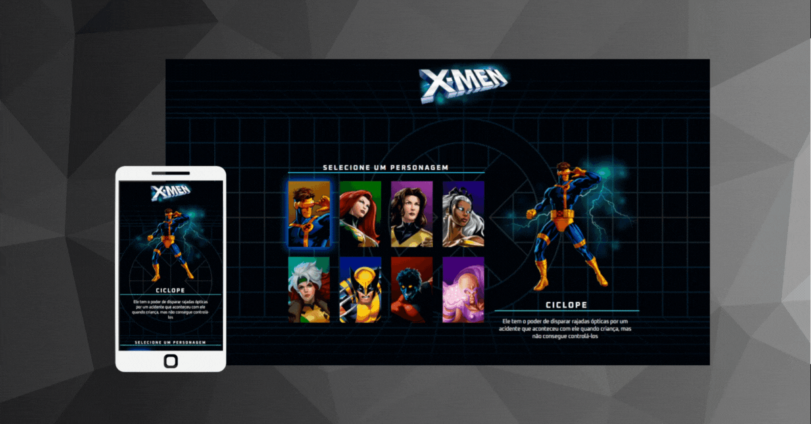

<h1 align="center"> Projeto X Men </h1>

Programa exclusivo e gratuito, feito juntamente com a equipe do DevQuest  
<a href="https://discord.gg/p4u9sqWyXz">Comunidade responsável.</a>

  <a href="#-tecnologias">Tecnologias</a>&nbsp;&nbsp;&nbsp;|&nbsp;&nbsp;&nbsp;
  <a href="#-projeto">Projeto</a>&nbsp;&nbsp;&nbsp;|&nbsp;&nbsp;&nbsp;
  <a href="#-layout">Layout</a>&nbsp;&nbsp;&nbsp;|&nbsp;&nbsp;&nbsp;
  <a href="#memo-licença">Licença</a>

  

 

  

## 🚀 Tecnologias

Esse projeto foi desenvolvido com as seguintes tecnologias:

- HTML e CSS
- JavaScript
- Git e Github
- Figma

## 💻 Projeto

O Projeto X Men layout com os personagens do desenho animado, onde ao passar o mouse a imagem e descrição do mesmo é exibida.

- [Acesse o projeto finalizado, online](https://nickolasluciano.github.io/xmen)

## 🔖 Layout

Você pode visualizar o layout do projeto através [DESSE LINK](https://www.figma.com/file/pcXaFvQGmgvIVwTAtfbzCc/Dev-em-Dobro?type=design&node-id=50%3A1148&mode=design&t=vTfeXATE0JKNc6DC-1). É necessário ter conta no [Figma](https://figma.com) para acessá-lo.

## :memo: Licença

Esse projeto está sob a licença MIT.

---
